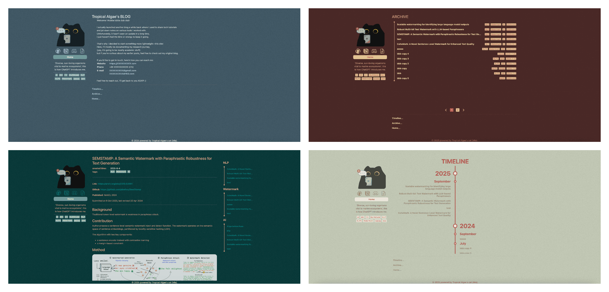

<p align="center"><strong><span style="font-size: 1.8em;">✨ TABlog</span></strong></p>
<p align="center">
  <a href="README.md"></a>
  <a href="README_CN.md"></a>
</p>

<p align="center" style="font-size: 1.2em;">A lightweight, markdown-driven personal blog 📝</p>

<hr>

### 🌟 Features:
- Lightweight and responsive blog with smooth animations
- Fully Markdown-driven with extensive customization options
- Easy to deploy with one-click startup scripts
- A reinvented wheel built by someone who doesn’t know much about frontend

### 📷 Preview:



### ⚙️ Deployment Environment

This project is deployed using Docker. Please ensure the following tools are installed in your environment **before deployment**:

> ⚠️ The versions listed below are for reference only. Using versions that are too old may cause the build to fail.

- **Docker**: v27.0.2  
- **npm**: v10.5.2  
- **Node.js**: v20.13.1  

### 🚀 Getting Started

#### 1. Add Your `.env` File

Refer to the [`.env.example`](.env.example) file and create your own `.env` file. A sample configuration is shown below:

| Name              | Description                          |
| ----------------- | ------------------------------------ |
| `VITE_SITE_TITLE` | The title of the website             |
| `VITE_WEB_PORT`   | The port used during development     |
| `IMAGE_NAME`      | The name of the Docker image         |
| `IMAGE_VERSION`   | The version of the Docker image      |
| `CONTAINER_PORT`  | The exposed port of the container    |
| `CONTAINER_MOUNT` | The directory mounted to the container |

#### 2. One-Click Build and Launch

Use the following commands to build the Docker image and run the container:

```bash
bash script/build.sh  # Package and build the Docker image
bash run.sh           # Start the container
```

### 🛠️ How to Use

#### 1. Add Your Configuration

In the `$CONTAINER_MOUNT/config` folder, add the configuration file [app.json](./public/config/app.json).

In this file:
- `md_labels` defines the keywords that will be recognized as tags. These keywords will be rendered as tags when the blog content is parsed. More details will be introduced later.
- `colors` defines the theme color palette for the blog. A random theme will be applied on each route navigation.

#### 2. Add Homepage Content

The homepage is rendered from a Markdown file.

Place the [home.md](./public/config/home.md) file in the `$CONTAINER_MOUNT/config` folder.

Place `avatar.png` and `favicon.ico` in the `$CONTAINER_MOUNT/images` folder to define your avatar and site icon.

> 📌 There are no strict rules for the content of `home.md`, but we recommend keeping it concise and avoiding complex structures.

#### 3. Update Your Blog

The update process includes 2 steps:
1. Add or update your blog posts in the `$CONTAINER_MOUNT/markdowns` directory.
2. Restart your Docker container.

You can organize your blog posts in nested folders under `$CONTAINER_MOUNT/markdowns`, but make sure all local file references in your Markdown files use **relative paths**.

At the beginning of each Markdown file, you can define the tags for that post using a list, separated from the main content by a horizontal line. Here's an example:

```markdown
- created_time: 2025-6-9
- tags: markdown
- tags: css
- tags: vue

---

<content>
... ...
```

The keywords in the list must be defined in `app.json` to be recognized as valid tags, or you can rely on the default configuration.

After parsing, the example will produce the following tags: `2025-6-9`, `markdown`, `css`, `vue`.