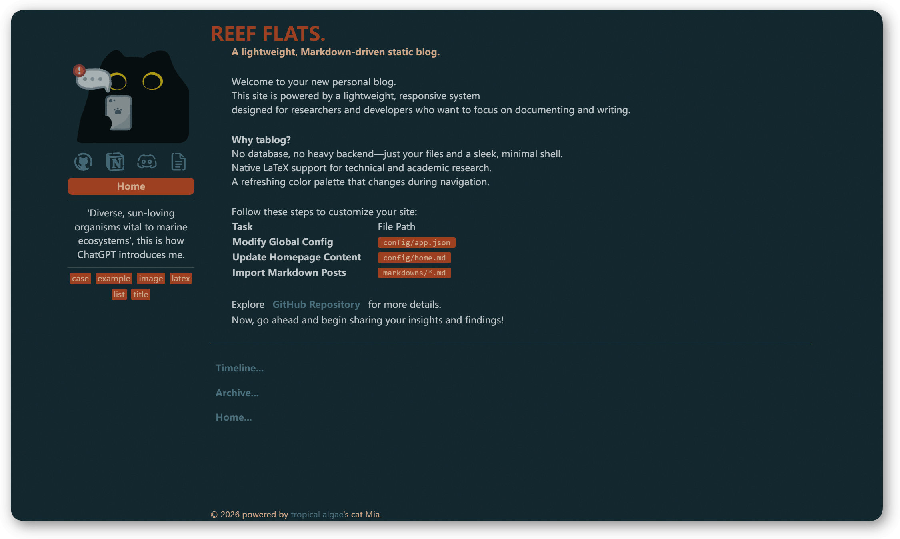

<div align="center">
  
  <h2 style="margin: 0.5rem">一个轻量级的、Markdown 驱动的个人博客</h2>
</div>

<p align="center">
  <a href="README.md"></a>
  <a href="README_CN.md"></a>
</p>



**Live Demo**: [Demo](https://tablog.reeflats.com)

## 特点：
- 轻量化、响应式的静态博客，动画流畅自然
- Markdown 驱动，简单易用，支持 LaTeX
- 部署便捷，内置一键启动脚本
- 是一个不懂前端的人重复造的轮子


## 如何启动？

### 1. 源码部署

参考 [本地构建方法](./.github/assets/local_build_cn.md)。

### 2. Docker部署（推荐）

定义环境变量：

```shell
export TABLOG_PORT=10000
export TABLOG_MOUNT=./
```

首次运行时，拷贝默认的配置文件以便挂载：

```shell
docker create --name tablog_tmp tropicalalgae/tablog:latest

docker cp tablog_tmp:/app/config ${TABLOG_MOUNT:-$(pwd)}
docker cp tablog_tmp:/app/images ${TABLOG_MOUNT:-$(pwd)}
docker cp tablog_tmp:/app/markdowns ${TABLOG_MOUNT:-$(pwd)}

docker rm tablog_tmp
```

启动容器：

```shell
docker run -itd --name tablog \
--restart=unless-stopped \
-p ${TABLOG_PORT:-10000}:80 \
-v ${TABLOG_MOUNT:-$(pwd)}/config:/app/config \
-v ${TABLOG_MOUNT:-$(pwd)}/images:/app/images \
-v ${TABLOG_MOUNT:-$(pwd)}/markdowns:/app/markdowns \
tropicalalgae/tablog:latest
```

---

## 如何使用？

### 1. 修改你的配置

修改挂载出的配日志文件 [config/app.json](./public/config/app.json)

| Key          | 说明           | 备注 |
|--------------|----------------|-----------|
| title        | 首页大标题     | 你的博客或项目名称 |
| sub_title    | 首页副标题     | 一句简短的描述或口号 |
| introduction | 侧边栏简介     | 支持纯文本或简短介绍 |
| copyright    | copyright信息 | 位于博客页脚 |
| label_map    | 标签元数据映射 | 被映射的label名出现在post开头时，将被渲染为tag |
| page_size    | 分页条数       | 归档页每页展示的文章数量 |
| links        | 社交/友链配置   | 支持四种类型的link |
| colors       | 主题颜色池     | 路由跳转时随机选中其中一个 |

### 2. 添加主页信息

主页将由一个markdown文件渲染。

1. 修改挂载出的主页Markdown [config/home.md](./public/config/home.md)
2. 替换挂载出来的 [images](./public/images) 文件夹下的头像 `avatar.png` 和网站图标 `favicon.ico`

> home中的内容没有显式的限制，但是我们建议您保持内容简洁，不要包含复杂结构

### 3. 更新博客

更新过程包括两个步骤:

1. 添加/更新 您的博客到 [markdowns/](./public/images) 中
2. 重启你的docker容器

可以使用嵌套的文件夹管理你在 [markdowns/](./public/images) 下的博客，但请确保markdown中的本地文件引用使用**相对路径**

在每个markdown的开头，您可以使用一个列表定义本篇博客的tag，并以分割线将其与正文区分。以下是基于默认配置实现一个例子:

```markdown
- created_time: 2025-6-9
- tags: markdown
- tags: css
- tags: vue

---

<content>
```

---

被识别为标签的关键字需要在 `app.json` 中定义。例如，当你配置了：

```json
"label_map": {
    "created_time": "ct",
    "tags": "tg"
}
```

则你的post应该修改为：

```markdown
- ct: 2025-6-9
- tg: markdown
- tg: css
- tg: vue

---

<content>
```

## License

本项目采用 [MIT License](https://github.com/tropical-algae/TABlog/blob/main/LICENSE) 许可