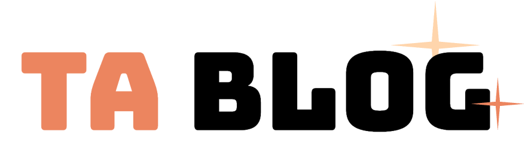
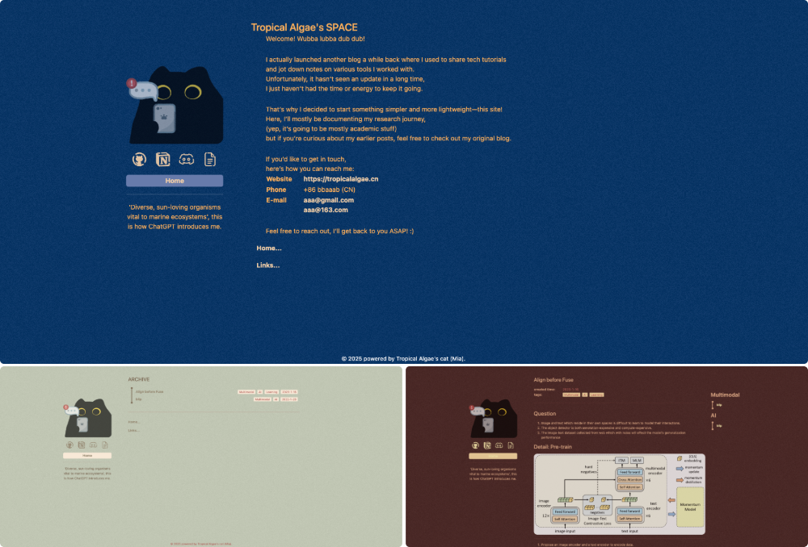

<div align="center">
  
  <h2 style="margin: 0.5rem">一个轻量级的、Markdown 驱动的个人博客</h2>
</div>

<p align="center">
  <a href="README.md"></a>
  <a href="README_CN.md"></a>
</p>

### 🌟 特点：
- 轻量的响应式博客，动画丝滑
- markdown驱动，大量可自定义的配置
- 部署简单、拥有一键启动脚本
- 是一个不懂前端的人重复造的轮子

### 📷 预览：



### ⚙️ 部署环境

项目基于Docker部署，部署前请确保你的环境中包含以下工具：

> ⚠️ 以下版本仅供参考，过低版本可能导致构建失败

- **Docker**： v27.0.2
- **npm**： v10.5.2
- **Node.js**： v20.13.1

### 🚀 如何启动？

#### 1. 添加你的 `.env`

参考[.env.example](.env.example)，创建一份属于你的 `.env` 文件，示例配置如下：

| 名称 | 介绍 |
| --- | --- |
| VITE_SITE_TITLE | 网页标题 |
| VITE_WEB_PORT | Dev阶段绑定的端口 |
| IMAGE_NAME | 打包的镜像名 |
| IMAGE_VERSION | 打包的镜像版本 |
| CONTAINER_PORT | 容器开放的端口 |
| CONTAINER_MOUNT | 容器挂载的目录 |

#### 2. 一键构建与启动

使用如下命令构建镜像并运行容器：

```bash
bash script/build.sh  # 打包并构建镜像
bash run.sh           # 启动容器
```
### 🛠️  如何使用？

#### 1. 添加你的配置

在 `$CONTAINER_MOUNT/config` 文件夹中，添加配置文件 [app.json](./public/config/app.json)

在该配置中，`label_map` 定义了可以作为标签被识别的关键字。在博客被解析时，这些关键字将被渲染为tag，相关细节将在后文介绍。

`colors` 定义了博客的主题配色。在路由跳转时，博客将随机切换一个主题。

#### 2. 添加主页信息

主页将由一个markdown文件渲染。

在 `$CONTAINER_MOUNT/config` 文件夹中，添加[home.md](./public/config/home.md)

在 `$CONTAINER_MOUNT/images` 文件夹中，添加 `avatar.png` 和 `favicon.ico` 以声明你的头像和图标。

> 📌 home中的内容没有显式的限制，但是我们建议您保持内容简洁，不要包含复杂结构。

#### 3. 更新博客

更新过程包括两个步骤:
1. 添加/更新 您的博客到 `$CONTAINER_MOUNT/markdowns` 中
2. 重启你的docker容器

可以使用嵌套的文件夹管理你在 `$CONTAINER_MOUNT/markdowns` 下的博客，但请确保markdown中的本地文件引用使用**相对路径**。

在每个markdown的开头，您可以使用一个列表定义本篇博客的tag，并以分割线将其与正文区分。以下是一个例子:

```markdown
- created_time: 2025-6-9
- tags: markdown
- tags: css
- tags: vue

---

<content>
... ...
```

列表中，被识别为标签的关键字需要在 `app.json` 中定义，或者你也可以使用默认的配置。

该例解析后将得到标签：`2025-6-9` `markdown` `css` `vue`
